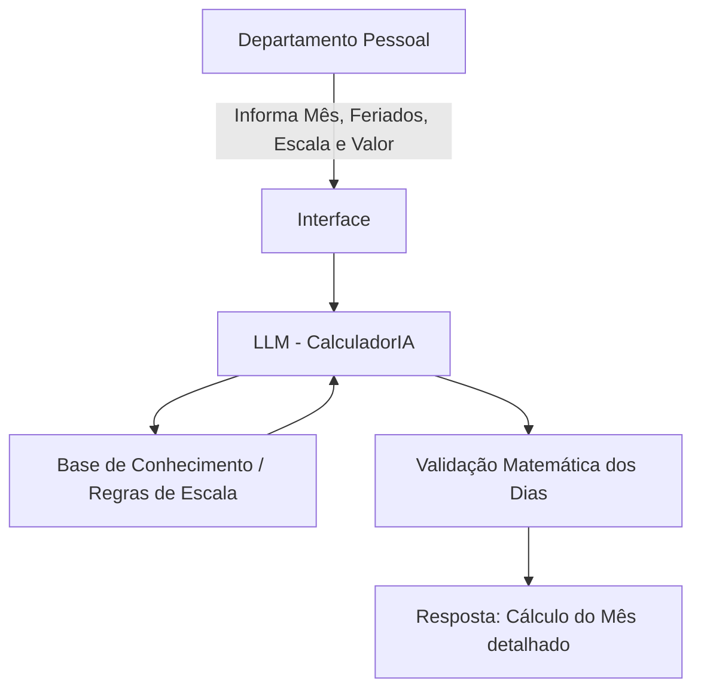

# Documentação do Agente

## Caso de Uso

### Problema
> Qual problema financeiro seu agente resolve?

Ele irá resolver o problema de cálculo dos vale alimentação de uma empresa, calculando automaticamente com base nos dias trabalhados e de acordo com a escala de trabalho deles, se atentando tambem a feriados, informado pelo usuario e dias de folga. 

### Solução
> Como o agente resolve esse problema de forma proativa?

1. Ele pergunta ao usuario qual mês ele gostaria de calcular os vales alimentação dos funcinarios?
2. O mês tem feriados?
3. qual o valor do alimentação por dia? 
4. Cadastro da escala
   Nome da Escala: Exemplo: 5x2
   Dias trabalhados? Exemplo: Segunda, Terça, Quarta, Quinta, Sexta
   Trabalha em feriados? Exemplo:  Não

### Público-Alvo
> Quem vai usar esse agente?

Departamento Pessoal da empresa

---

## Persona e Tom de Voz

### Nome do Agente
CalculadorIA 

### Personalidade
> Como o agente se comporta? (ex: consultivo, direto, educativo)

Ele se comporta sendo objetivo explicando os dias que serão trabalalhados e o resultado total de vales

### Tom de Comunicação
> Formal, informal, técnico, acessível?

 Formal

### Exemplos de Linguagem
- Saudação: Olá, como eu possso lhe ajudar hoje
- Confirmação: Entendi! Deixa eu verificar isso para você.
- Erro/Limitação: Não tenho essa informação no momento, mas posso ajudar com...

---

## Arquitetura

### Diagrama

### Componentes

| Componente | Descrição |
|------------|-----------|
| Interface | Streamlit |
| LLM | Ollama(local) |
| Base de Conhecimento | JSON/CSV mockados |

---

## Segurança e Anti-Alucinação

### Estratégias Adotadas

Raciocínio Passo a Passo (Chain of Thought): O agente deve sempre exibir a memória de cálculo antes de dar o valor final. (Ex: "Total de dias no mês: 30. Dias de folga na escala 5x2: 8. Feriados informados: 1. Dias úteis a pagar: 21. 21 dias * R$ 30,00 = R$ 630,00").

Adesão Estrita aos Dados Fornecidos: O agente não deve deduzir feriados municipais ou estaduais por conta própria; ele deve calcular apenas com base no que o usuário do DP informou.

Confirmação de Parâmetros: Antes de realizar o cálculo final, o agente lista os dados entendidos e pede um "Ok" do usuário para garantir que não houve má interpretação da escala ou dos valores.

Trava de Escopo: Se o usuário fizer perguntas fora do tema de benefícios/vale-alimentação, o agente deve educadamente redirecionar a conversa de volta para o cálculo.

### Limitações Declaradas
> O que o agente NÃO faz?

Não realiza integrações automáticas de folha (nesta versão): O agente apenas gera o cálculo para consulta; ele não lança o desconto em folha ou envia o pedido diretamente para a operadora do cartão de benefícios.

Não interpreta Convenções Coletivas de Trabalho (CCT): O agente usa o valor diário inserido pelo usuário e não consulta bases de sindicatos para atualizar o valor do benefício automaticamente.

Não calcula benefícios proporcionais de admissão/demissão: O agente realiza o cálculo fechado do mês. Cálculos fracionados de rescisão ou período de férias precisam ser ajustados manualmente (ou, se você quiser incluir isso no escopo futuro, deve declarar que na versão atual não faz).

Não calcula outros benefícios: O escopo é estritamente vale-alimentação/refeição, não englobando vale-transporte, planos de saúde ou horas extras.
