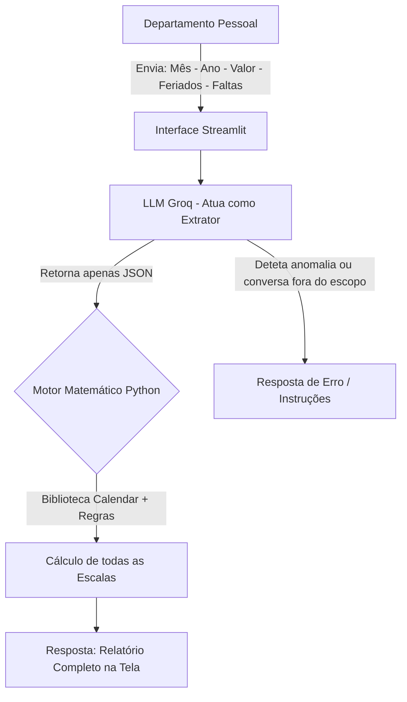

# Documentação do Agente

## Caso de Uso

### Problema
> Qual problema financeiro seu agente resolve?

O agente resolve o problema de cálculo dos vales-alimentação de uma empresa, eliminando erros humanos e alucinações de IA. Ele calcula automaticamente o valor devido com base no mês, ano, descontos de faltas e dias de feriado informados pelo utilizador, processando múltiplas escalas de trabalho em simultâneo.

### Solução
> Como o agente resolve esse problema de forma proativa?

1. O agente recebe um input único e ágil do utilizador no formato padronizado: `Mês - Ano - Valor - Feriados - Faltas`.
2. A IA (atuando como extratora) converte este texto natural num objeto JSON estruturado.
3. O motor matemático (em Python) cruza esses dados com o calendário oficial do mês solicitado.
4. O sistema processa e exibe um relatório único com o cálculo de todas as escalas principais (5x2, 6x1, 12x36 Par e 12x36 Ímpar) de uma só vez, aplicando as regras de dedução ou pagamento de feriados específicas de cada escala.

### Público-Alvo
> Quem vai usar esse agente?

Profissionais do Departamento Pessoal e Recursos Humanos da empresa.

---

## Persona e Tom de Voz

### Nome do Agente
CalculadorIA 

### Personalidade
> Como o agente se comporta? (ex: consultivo, direto, educativo)

Ele comporta-se como um assistente ultrarrápido, objetivo e direto ao ponto. Não é prolixo. Ele guia o utilizador para o formato de entrada correto e entrega o relatório de cálculo mastigado e organizado.

### Tom de Comunicação
> Formal, informal, técnico, acessível?

Formal, técnico e organizado.

### Exemplos de Linguagem
- **Saudação/Instrução:** "Olá! Tudo bem? 👋 Para um cálculo super rápido de todas as escalas, envie os dados separados por hífen..."
- **Confirmação/Sucesso:** "✅ Relatório de Cálculo - Todas as Escalas..."
- **Erro/Trava:** "Desculpe, não compreendi. Vamos tentar novamente..."

---

## Arquitetura

### Diagrama

### Componentes

| Componente | Descrição |
|------------|-----------|
| **Interface** | Streamlit (Frontend web interativo) |
| **LLM (Cérebro Extrator)** | API Groq (Modelo `llama-3.1-8b-instant`) |
| **Motor Matemático** | Bibliotecas nativas do Python (`calendar` e `datetime`) |

---

## Segurança e Anti-Alucinação

### Estratégias Adotadas

1. **Delegação Matemática (Arquitetura Híbrida):** A maior estratégia anti-alucinação deste projeto. A IA **não** realiza contas de somar, subtrair ou validação de calendário. A IA atua estritamente como um processador de linguagem natural para gerar um JSON. A matemática exata é delegada ao Python.
2. **Prompt Restrito (Roteamento):** O System Prompt foi desenhado como um classificador cego. Ele só tem três saídas possíveis: gerar o JSON, devolver "INSTRUCOES" ou devolver "ERRO". Isso bloqueia tentativas de *Prompt Injection* (ex: pedir para a IA escrever códigos de programação ou criar poemas).
3. **Imunidade a Feriados Falsos:** O sistema não tenta adivinhar o calendário de feriados (que varia por cidade/estado). Ele baseia-se 100% nos números exatos de feriados que o profissional de DP informou na entrada.

### Limitações Declaradas
> O que o agente NÃO faz?

- **Não realiza integrações automáticas de folha (nesta versão):** O agente gera o cálculo para consulta do analista; ele não lança o desconto em softwares de folha (ex: TOTVS, Senior) nem envia o pedido para a operadora do cartão de benefícios.
- **Não atualiza valores por CCT:** O agente usa o valor diário inserido pelo utilizador e não consulta bases de sindicatos para atualizar o valor do benefício automaticamente.
- **Não calcula rescisões fracionadas:** O agente realiza o cálculo fechado do mês. Cálculos fracionados de rescisão ou admissão no meio do mês precisam de ajuste manual.
- **Não calcula outros benefícios:** O escopo é estritamente vale-alimentação/refeição, não englobando vale-transporte, planos de saúde ou horas extras.
